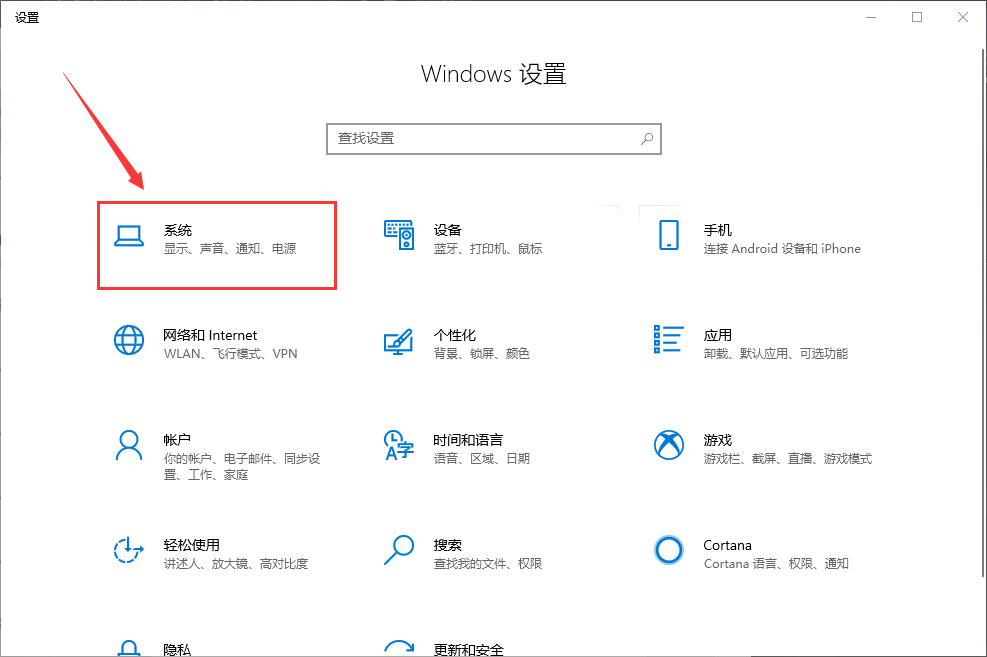
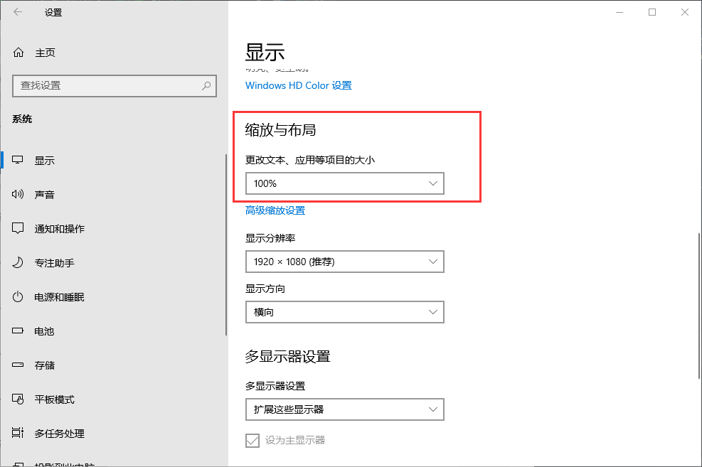

# 使用须知

## 一、使用环境

1. 如果电脑上有java环境以及IDEA软件，可以导入项目，点开项目，按照src/TankTest/main/Gamemain.java 路径打开
   如果没有java，可以双击坦克大战.exe运行。
2. 可以直接打开exe运行。

## 二、游戏分辨率

* 如果打开后游戏界面大于桌面的长宽，说明您的电脑设置了更改文本、应用等项目的大小，以下说明如何设置：

  1. 按下快捷键`win+i`或者手动打开win10设置，点击系统设置

     

  2. 在显示中找到缩放与布局，将"更改文本、应用等项目的大小"改为100%即可

     

## 三、游戏操作说明

进入游戏后有以下四个按钮，可用鼠标直接按四个按钮，也可按tap键选择按钮并且按enter键进入

### 1. 开始游戏 ：

进入游戏后，WASD按键分别控制坦克的上左下右移动，J按键发射普通炮弹，U按键发射穿墙炮弹（可无限穿粉墙）

* I按键发射散弹，按下K按键蓄力两秒后松开发射蓄力子弹，发射后再次按K键可以引爆发出的蓄力子弹，按O键放炸弹；
* 玩家需将所有的敌方坦克打死方可进入下一关，若玩家坦克被打死或者水晶被打死则通关失败重新回到第一关。
* 地图中出现的四种道具：
  * 加血道具：吃了可以增加2滴血，6滴血上限
  * 加弹药道具：吃了可以增加穿墙子弹和散射子弹各一枚
  * 加快移速道具:吃了后13秒内坦克移速是默认速度的两倍
  * 加快射速道具：吃了后13秒内发射的子弹是原来的两倍

### 2. 地图预览：   

按地图预览按钮，左上角有显示关卡总数（默认2个关卡）以及当前关卡，按“上一关““下一关”可以切换关卡地图，还有删除关卡的功能，若想退出地图预览，则点返回按钮。

### 3. 地图绘制：  

按地图绘制按钮，会随机显示出一个默认地图样板供玩家参考（样板中的墙可自行操作删除），右上角有六个功能键：

1. 用鼠标点第一个功能键后再去点地图，可以生成粉墙
2. 用鼠标点第二个功能键后再去点地图，可以生成铁墙
3. 用鼠标点第三个功能键后再去点地图，可以生成河流
4. 用鼠标点第四个功能键后再去点地图，可以生成草地
5. 用鼠标点第五个功能键后再去点地图，可以将鼠标所点的墙删除
6. 用鼠标点第六个功能键后，可以将地图中所有的墙删除（该功能太贴心了）

### 4. 退出游戏：   

按退出游戏按钮会弹出一个确定退出的窗口
